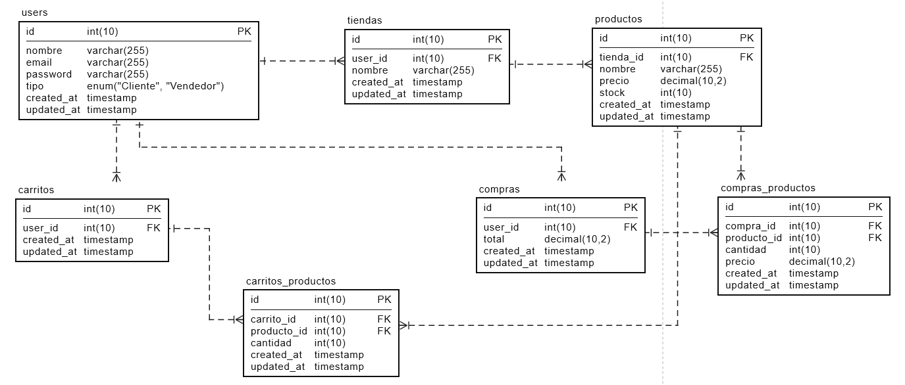

## Diagrama Base de Datos

A continuación se presenta el Diagrama de la BD de la API Tienda:

## API TIENDA

### A continuación un breve resúmen de las rutas y cómo se probaron en POSTMAN

| Método   | URL                                     | Body |
|----------|-----------------------------------------|-------------|
| **POST** | `/api/register`                        | `{ "name": "Juan", "email": "juan@example.com", "password": "123456", "tipo": "Vendedor" }` |
| **POST** | `/api/login`                           | `{ "email": "juan@example.com", "password": "123456" }` |
| **POST** | `/api/logout`                          | *Token en header (`Authorization: Bearer {token}`)* |
| **GET**  | `/api/user`                            | *Token en header (`Authorization: Bearer {token}`)* |
| **GET**  | `/api/tiendas`                         | *N/A* |
| **POST** | `/api/tiendas`                         | `{ "nombre": "Tienda XYZ" }` |
| **GET**  | `/api/tiendas/{id}`                    | *N/A* |
| **PUT**  | `/api/tiendas/{id}`                    | `{ "nombre": "Nuevo nombre" }` |
| **DELETE** | `/api/tiendas/{id}`                  | *N/A* |
| **GET**  | `/api/tiendas/{tienda}/productos`      | *N/A* |
| **POST** | `/api/tiendas/{tienda}/productos`      | `{ "nombre": "Laptop", "precio": 15000, "stock": 10 }` |
| **GET**  | `/api/ver-productos`                   | *N/A* |
| **GET**  | `/api/carrito`                         | *N/A* |
| **POST** | `/api/carrito/agregar`                 | `{ "producto_id": 2, "cantidad": 3 }` |
| **DELETE** | `/api/carrito/remover/{producto}`    | *N/A* |
| **DELETE** | `/api/carrito/vaciar`                | *N/A* |
